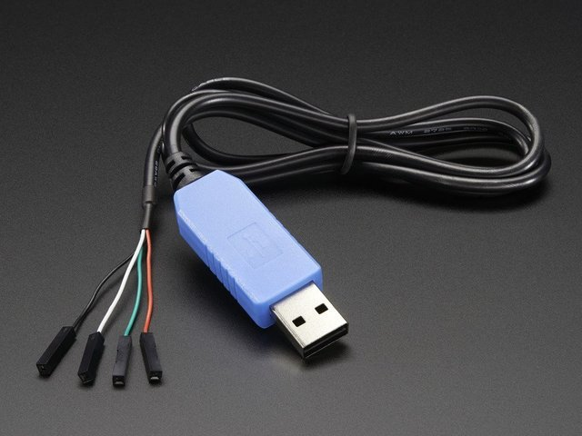
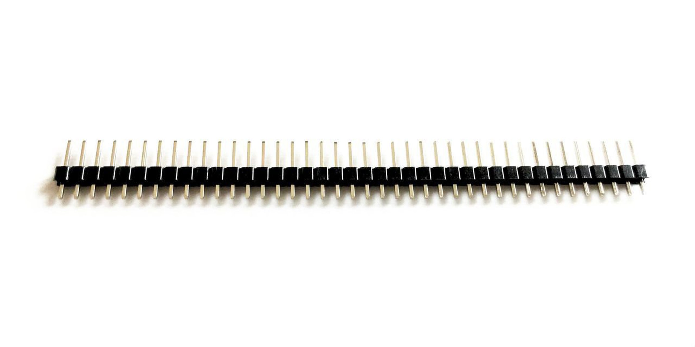
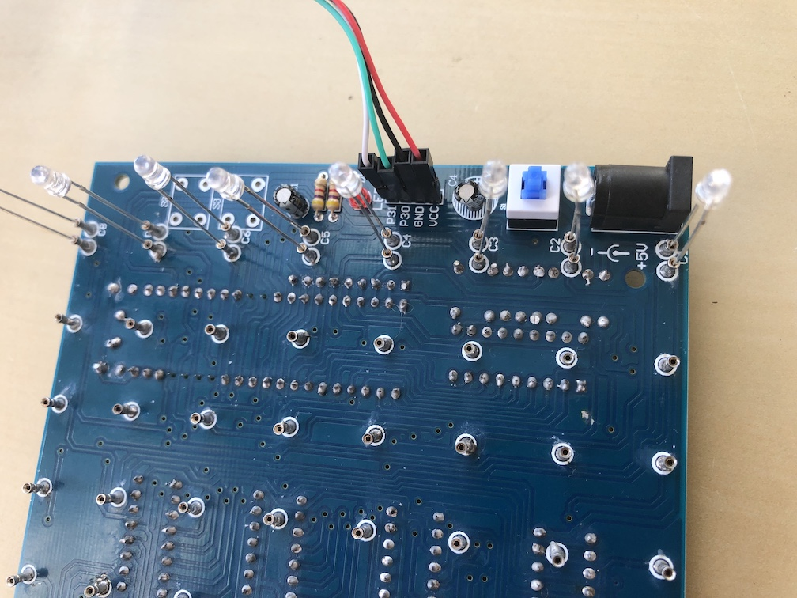

# 8x8x8-led-cube-firmware
A process to update the firmware on a Geekcreit® 8x8x8 LED Cube 3D Light Square Blue LED Electronic DIY Kit and get it cycling animations, using a Mac OSX.

## The Problem
I got this [Geekcreit® 8x8x8 LED Cube 3D Light Square Blue LED Electronic DIY Kit](https://www.banggood.com/8x8x8-LED-Cube-3D-Light-Square-Blue-LED-Electronic-DIY-Kit-p-1055438.html) from Banggood ("the kit"). It came without instructions, but luckily there are pleanty of good tutorials on the internet such as [this one](https://www.instructables.com/id/Assembling-the-Geekcreit-8x8x8-LED-Cube-3D-Light-S/).

After soldering all the components and testing with 8 LEDs, only 3 of them light up and there are is no animation, as seen in this video:

[](https://www.youtube.com/watch?v=K0GXyDZfTuo)

:poop: The chip in the kit is supposed to come with the code pre-loaded, however as I discovered that was not the case.

Here is what I did to get it working:

## The Hardware
* USB-to-TTL Serial Cable which you can get from [Adafruit](https://www.adafruit.com/product/954) or [Amazon](https://smile.amazon.com/gp/product/B00DJUHGHI).



* Header pins [such as these](https://www.tindie.com/products/nifteecircuits/40-pin-breakaway-header/)


* Cut off 4 headers and solder them on the kit's board, next to the red LEDs where labled P31, P30, GND, VCC. I soldered them on top, but consider soldering them on the bottom for aesthetic reasons. 

## The Process
Note that I have a Mac (running Mojave OS at the time). I think this process would work on Windows too, as long as it has Python 3.2 or later. Otherwise take a look at the link under the Resources section at the bottom.

* Install drivers for the USB cable, and don't forget to reboot. https://learn.adafruit.com/adafruits-raspberry-pi-lesson-5-using-a-console-cable/software-installation-mac

* Install this open source STC MCU ISP flash tool to communicate with the chip: https://github.com/grigorig/stcgal

* At this point you can connect the pins to the board and plug the USB cable to your computer. Get the colors right!
White = P31  
Green = P30  
Black = GND  
Red   = VCC



* Ensure the power button is off, and don't connect the 5v power cable that came with the kit. You might notice the red LED has a faint light even though the kit is off.
<picture>

* Now you'll need to figure out the serial port asigned to the cable by the OS. Run the following command:
```
$ ls /dev/cu.*
/dev/cu.Bluetooth-Incoming-Port	/dev/cu.SLAB_USBtoUART
```
Clearly it's the 2nd match.

* Test your setup. Ensure the power button is off. You'll be prompted to turn it on:
```
$ stcgal -p /dev/cu.SLAB_USBtoUART -P stc12
Waiting for MCU, please cycle power: <TURN THE POWER ON>
done
Target model:
  Name: STC12C5A60S2
  Magic: D17E
  Code flash: 60.0 KB
  EEPROM flash: 2.0 KB
Target frequency: 11.981 MHz
Target BSL version: 7.1I
Target options:
  reset_pin_enabled=True
  low_voltage_reset=False
  oscillator_stable_delay=32768
  por_reset_delay=long
  clock_gain=high
  clock_source=external
  watchdog_por_enabled=False
  watchdog_stop_idle=True
  watchdog_prescale=256
  eeprom_erase_enabled=False
  bsl_pindetect_enabled=False
Disconnected!
```

* Turn the kit off. To update the firmware, navigate to the 'firmware' directory and run the following command:
```
$ stcgal -p /dev/cu.SLAB_USBtoUART -P stc12 8X8X8.hex
Waiting for MCU, please cycle power: done
Target model:
  Name: STC12C5A60S2
  Magic: D17E
  Code flash: 60.0 KB
  EEPROM flash: 2.0 KB
Target frequency: 11.981 MHz
Target BSL version: 7.1I
Target options:
  reset_pin_enabled=True
  low_voltage_reset=False
  oscillator_stable_delay=32768
  por_reset_delay=long
  clock_gain=high
  clock_source=external
  watchdog_por_enabled=False
  watchdog_stop_idle=True
  watchdog_prescale=256
  eeprom_erase_enabled=False
  bsl_pindetect_enabled=False
Loading flash: 3806 bytes (Intel HEX)
Switching to 19200 baud: testing setting done
Erasing 16 blocks: done
Writing flash: 4224 Bytes [00:03, 1381.81 Bytes/s]
Finishing write: done
Setting options: done
Target UID: D17E84A1500BF3
Disconnected!
```

## The End Result
Click to open in YouTube:

[](https://www.youtube.com/watch?v=7zrhvEkyWA0)

:+1:

## Additional Resources
* I got the firmware code from https://github.com/tomazas/ledcube8x8x8 . It also has instructions for uploading firmware using the manufacturer's software on Windows, as well as additional firmware versions.
* Good blog post with helpful information: http://www.forgani.com/electronics-projects/led-cube/

